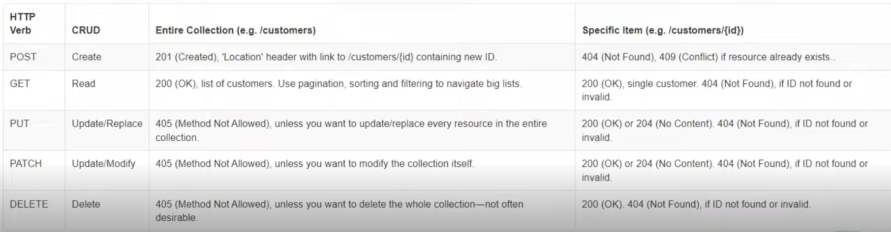

<h1>
    
     Curso oeferecido pela DIO XP Inc. - Full Stack Developer
</h1>

> ## 📕 O repositório tem como objetivo armazenar resumos e o conteúdo passado em aula sobre APIs com C#.

# ⭐ Construindo APIs com C#
## 🚀 ``Introdução a APIs com C#``
### 1️⃣ IIntrodução a APIs
#### 📍 Introdução:

* Aprender e desenvolver uma API, utilizando o Entity Framework para persistência de dados, juntamente com seus princiapis conceitos e funcionalidades.

#### 📍 O que é uma API:

* Uma API (Application Progrgamming Interface) é uma forma de comunicação entre computadores ou programas de computadores.

* Em outras palavras, é uma software que fornece informações para outros softwareS.
<!-- 
#### 📍 API de feriados:
* Acessar o site: [date.nager.a](https://date.nager.at/api/v3/PublicHolidays/2024/BR)
* Clilcar em Holiday API -> Clicar no link da API -> Mudar o código do páis na URL

#### 📍 Usando o Dog API:
* Acessar o site: [Dog API](https://dog.ceo/dog-api)
* Gera imagem aleatória de cachorros -->

#### 📍 Criando nossa API:

* Comando parar criar API em .NET: ``dotnet new webapi``
* Comando para assistir as mudanças em tempo real sem precisar para o servidor (abre a documentação): ``dotnet watch run``
> Apenas a minha máquina pode rodar o endereço localhost
* Clicar em Weatherforecast no endereço que abrir -> Try it out -> Execute
* Podemos documentar e testar nossa API no Swagger 

#### 📍 Criando a controller:
* Uma controller é uma classe que vai agrupar as nossas requisições HTTP e vai disponibilizar os os endpoints.

* Criar pasta Controller -> Adicionar arquivo UsuarioController.cs

~~~~C#
using System;
using System.Collections.Generic;
using System.Linq;
using System.Threading.Tasks;
using Microsoft.AspNetCore.Mvc;  // Adicionado 

namespace ModuloAPI.Controllers
{
    [ApiController] // Adicionado
    [Route("api/[controller]")] // Adicionado
    public class UsuarioController : ControllerBase // Adicionado 
    {   
        // Como vamos dar nome para como vamos chamar o método na API
        [HttpGet("ObterDataHoraAtual")]

        // Método que retorna a data e a hora
        public IActionResult ObterDataHora()
        {
            // Cria objeto anônimo que retorna a data e depois a propriedade DataHora
            var obj = new
            {
                // Retorna a data e a hors
                Data = DateTime.Now.ToLongDateString(),
                Hora = DateTime.Now.ToLongTimeString()
            };

            // Retorna requisição/objeto HTTP
            return Ok(obj); //Método que retorna um objeto
        }
    }
}
~~~~

> Retomar dotnet watch run -> a API vai aparecer lá e é só executar

* Cada controller é uma sessão no Swagger
* Montar caminho: ArquivoController +  ``[HttpGet("ObterDataHoraAtual")]``
> Ignora o controller
* Após isso ele retorna o método

#### 📍 Endpoint com parâmetro:

~~~~C#
namespace ModuloAPI.Controllers
{
    [ApiController] // Adicionado
    [Route("api/[controller]")] // Adicionado
    public class UsuarioController : ControllerBase // Adicionado 
    {   
        ...

        // Adiciona um parâmetro na URL onde vamos colocar um nome
        [HttpGet("Apresentar/{nome}")]

        // Passa parâmetro para o método
        public IActionResult Apresentar(string nome)
        {
            var mensagem = $"Olá {nome}, seja bem vindo!";// lê o parâmetro passado e adiciona o nome na mensagem
            return Ok(new{mensagem}); // Retorna var mensagem
        }
    }
}
~~~~

## 🚀 ``Trabalhando com Entity Framewok com C#``
### 1️⃣ Entity Framework e CRUD

#### 📍 Introdução:

* o EF é um framework ORM (Object-Relational Mapping) criado para facilitar a integração com o banco de dados, mapeando tabelas e gerando comandos SQL de forma automática.

#### 📍 Entendendo o CRUD:
* C - CREATE (Insert) R - READ (Select) U - UPDATE (Update) D - DELETE (Delete)

#### 📍Instalando pacotes:
* ``dotnet tool install --global ditnet-ef``: ferramenta para executar comandos do Entity Framwork diretamente pelo console.
> Só precisa executar 1 vez.

* ``dotnet add package Microsoft.EntityFrameWorkCore.Design``: pacote do Entity FrameWork Core
> Precisa executar em todo projeto

* ``dotnet add package Microsoft.EntityFrameWorkCore.SqlServer``: Pacote do SQL Server
> Precisa executar em todo projeto

#### 📍Criando a classe entidade:

* O objetido será fazer um CRUD de contatos
* Criar pasta Entities(Models) -> tudo que ta na pasta se refere a uma tabela do banco de dados -> Criar classe Contatos.cs (dentro da pasta)

**Contados.cs:**
~~~~C#
using System;
using System.Collections.Generic;
using System.Linq;
using System.Threading.Tasks;

namespace ModuloAPI.Entities
{
    public class Contato
    {
        public int Id { get; set; }
        public string Nome { get; set; }
        public string Telefone { get; set; }
        public bool Ativo { get; set; }
    }
}
~~~~

#### 📍Criando o contexto:

* Contexto seria uma classe que centraliza todas as informações em um determinado banco de dados
* AgendaContext.cs faz a ligação com o banco de dados

**AgendaContext.cs:**
~~~~C#
using System;
using System.Collections.Generic;
using System.Linq;
using System.Threading.Tasks;
using Microsoft.EntityFrameworkCore; // Importa pelo DbContext
using ModuloAPI.Entities; // Importa pelo <Contato>

namespace ModuloAPI.Context
{   
    // Adiciona heraça DbContext que contém as operações necessárias para trabalharmos com banco de dados
    // A classe AgendaContext é a classe que vai acessar/conectar o banco de dados , por isso tem que herdar de DbContext
    public class AgendaContext : DbContext

    {
        // Criando construtor que vai se conectar com o banco de dados
        public AgendaContext(DbContextOptions<AgendaContext> options) : base(options)
        // Recebemos a conexão/configuração do banco e passamos para o base ou seja, para o DBContext, para em seguida representarmos uma tabela através do DbSet.
        // Podemos ver o valor desses parâmetros sendo passados no Program.cs onde passamos as configurações para conexão com o banco.
        {

        }

        // Precisamos colocar uma propriedade que refere a nossa entidade (Contato.cs)
        public DbSet<Contato> Contatos {get; set;}
        // <Contato>: está dentro de um DbSet porque é representado por uma classe/objeto e também por uma tabela no banco de dados, isso é chamado de entidade

        // Contatos: nome que damos ao objeto/tabela
    }
}
~~~~

#### 📍Configurando a conexão:

* appsettings.Development.JSON: usamos para testes de desenvolvimento
* appsettings.JSON: usamos para implementação, ou seja para implementar o nosso sistema em um ambiente real
> Cadastramos nossa conexão com o banco de dados nesses arquivos.

**appsettings.Development.JSON:**
~~~~JSON
{
  "Logging": {
    "LogLevel": {
      "Default": "Information",
      "Microsoft.AspNetCore": "Warning"
    }
  },
  "ConnectionStrings": {
    "ConexaoPadrao": "Server=localhost\\sqlexpress; Initial Catalog=Agenda; Integrated Security=True" 
  }
}
~~~~
``"ConexaoPadrao": "Server=localhost\\sqlexpress; Initial Catalog=Agenda; Integrated Security=True" ``: String de conexão
* Se formos usar outro formato de banco de dados por exemplo o MySQL essa string muda
* ``Server=localhost\\sqlexpress``: conexão do banco
* ``catalog=Agenda``: nome do banco de dados
* ``Integrated Security=True``: Autenticação (no caso não vamos passar usuário e senha, apenas a autenticação do Windows)

**Program.cs:**
~~~~C#
using ModuloAPI.Context; // Importamos
using Microsoft.EntityFrameworkCore; // Importamos

var builder = WebApplication.CreateBuilder(args);

// Add services to the container.
builder.Services.AddDbContext<AgendaContext>(options => 
    options.UseSqlServer(builder.Configuration.GetConnectionString("ConexaoPadrao"))); // Falando que o AgendaContext.cs vai usar a string que conexão do JSON
...
~~~~

* ``AddDbContext<AgendaContext>``: Adiciona um dbContext do tipo AgendaContext
* ``options => options.UseSqlServer``: Passa as opções e usa o SQL Server (se fosse MYSQL seria UseMsql)
* ``builder.Configuration``: Pega as configurações do appsettings.Development.json
* ``GetConnectionString``: Pega a chave ConnectionStrings
* ``"ConexaoPadrao"``: Acessa o valor da chave ConnectionStrings: "ConexaoPadrao"

#### 📍Entendendo as migrations:
* Comandos de criação de tabelas precisam ser feitas de maneira manual.
* Dizer ao Entity que temos alterações no código que precisam ser refletidas no banco dados.
* O SQL Server tem que estar rodando no SQL Management Studio.

**Criando migration:**

* ``dotnet-ef migrations add CriacaoTabelaContato``
* ``dotnet-ef``: ferramenta dotnet-ef
* ``migrations``: ferramenta que vai atualizar o banco de dados
* ``add``: adicionar uma nova migration
* ``CriacaoTabelaContato``: nome da migration (é bom que seja descritivo)
> A partir disso nossa tabela é criada: 20240926042212_CriacaoTabelaContato.cs
* Por padrão configuramos a nossa classe no singular, mas no banco de dados ela é criada no plural (adiciona um s)

**Aplicando migration:**
``dotnet-ef database update ``: faz o update no banco de dados
> Caso de erro de certificação, basta adicionar o seguinte comando na string de conexão: TrustServerCertificate=True

#### 📍Criando a controller e o endpoint de Create:
* Criamos o arquivo ContatoController.cs:

~~~~C#
using System;
using System.CodeDom.Compiler;
using System.Collections.Generic;
using System.Linq;
using System.Threading.Tasks;
using Microsoft.AspNetCore.Mvc; // +
using ModuloAPI.Context; // +
using ModuloAPI.Entities; // +

namespace ModuloAPI.Controllers
{
    [ApiController] // +
    [Route("[controller]")] // +
    public class ContatoController : ControllerBase // Realiza a herança com ControllerBase
    {
        // Adicionando endpoints que queremos que nossa API tenha
        // O objetivo é implementar um CRUD na tabela de contato

        // Atributo do tipo privado somente de leitura
        // Propriedade _context da AgendaContext.cs
        private readonly AgendaContext _context;

        // Vamos receber via construtor o AgendaContext.cs, contexto que nos permite acessar o banco de dados
        public ContatoController(AgendaContext context)
        {
            // Recebe o context do construtor e passamos para a propriedade _context
            _context = context;
        }

        // Como estamos enviando uma informação o método mais adequado é o HTTpPost
        [HttpPost] 

        // Método de criação:
        public IActionResult Create(Contato contato)
        {
            _context.Add(contato);
            _context.SaveChanges();
            return Ok(contato);
        }
        
    }
}
~~~~

* Executar o comando ``dotnet watch run`` -> try out -> preencher as informações no JSON

~~~~JSON
{
  //"id": int
  "nome": "Contato de teste 1",
  "telefone": "1111111",
  "ativo": true
}
~~~~
> Apagamos o campo do ID que será incrementado automaticamente

> Após isso essa informação já está disponível no banco

#### 📍Criando O endpoint obter por ID:

**ContatoController.cs:**
~~~~C#
namespace ModuloAPI.Controllers
{
    [ApiController] 
    [Route("[controller]")] // +
    public class ContatoController : ControllerBase
    {
        private readonly AgendaContext _context;

        public ContatoController(AgendaContext context)
        {
            _context = context;

        }

        ...

        [HttpGet("{id}")]
        // O endpoint vai ficar /contato/id
        // o id vai ser o id da tabela do banco de dados
        public IActionResult ObterPorId(int id)
        {
            var contato = _context.Contatos.Find(id);
            // Relembrando que contatos se trata do Context Dbset
            // A variável contato recebe o ID retornado na requisição

            if (contato == null) // Caso o contato for nulo retorna NotFound(), se não retorna a informação do contato que ele armazenou
                return NotFound();
            return Ok(contato);
        }
    }
}
~~~~

* Executar o swagger -> /Contato/{id} -> Try out -> Colocar o id -> Ele irá retornar as informações do contato pelo ID:

~~~~JSON
{
  "id": 1,
  "nome": "Contato de teste 1",
  "telefone": "1111111",
  "ativo": true
}
~~~~

> O caminho fica: http://localhost:5021/Contato/1

> O banco também irá receber essas informações

#### 📍Criando O endpoint de update:
**ContatoController.cs:**
~~~~C#
namespace ModuloAPI.Controllers
{
    [ApiController] 
    [Route("[controller]")] // +
    public class ContatoController : ControllerBase /
    {
    
        private readonly AgendaContext _context;

        public ContatoController(AgendaContext context)
        {
            _context = context;

        }

        ...

        [HttpPut("{id}")]
        public IActionResult Atualizar(int id, Contato contato)
        // id: Contato que será atualziado
        // contato: JSON para poder atualizar as informações
        {
            var contatoBanco = _context.Contatos.Find(id);
            // O contato vem do banco e não da requisição

            if(contatoBanco == null)
                return NotFound();

            contatoBanco.Nome = contato.Nome;
            // O nome do contato no banco de dados é igual ao nome do contato que estamos recebendo na requisição
            contatoBanco.Telefone = contato.Telefone;
            contatoBanco.Ativo = contato.Ativo;

            // Atualiza e salva as informações do contato no banco
            _context.Contatos.Update(contatoBanco);
            _context.SaveChanges();

            // Retorna o banco atualizado com as informações
            return Ok(contatoBanco);
        }
    }
}
~~~~

* Executar o swagger -> /Contato/{id} -> Try out -> Colocar o id -> Preencher as informações -> Ele irá retornar as informações atualizadas:

~~~~JSON
{
  "id": 1,
  "nome": "Contato atualizado com sucesso",
  "telefone": "222222222",
  "ativo": false
}
~~~~

> O caminho fica: http://localhost:5021/Contato/1

> O banco também irá receber essas informações

#### 📍 Criando o endpoint do delete:

**ContatoController.cs**
~~~~C#
namespace ModuloAPI.Controllers
{
    [ApiController]
    [Route("[controller]")]
    public class ContatoController : ControllerBase /
    {
        private readonly AgendaContext _context;

        public ContatoController(AgendaContext context)
        {
            _context = context;
        }

       ...

        [HttpDelete("{id}")]
           public IActionResult Deletar(int id)
        {
            var contatoBanco = _context.Contatos.Find(id);
            // O contato vem do banco e não da requisição

            if(contatoBanco == null)
                return NotFound();
            
            // Remove o contato passado pelo ID
            _context.Contatos.Remove(contatoBanco);
            _context.SaveChanges();

            // Retorna 'sem contéudo'
            return NoContent();
        }
    }
}
~~~~

* Executar o swagger -> /Contato/{id} -> Try out -> Colocar o id -> irá deletar o registro:

~~~~JSON
 date: Thu,26 Sep 2024 06:43:50 GMT 
 server: Kestrel 
~~~~

> A família de códigos 200 significa sucesso 
> 204: teve sucesso mas não retorna nada

#### 📍 Criando endpoint para obter por nome:

~~~~C#
namespace ModuloAPI.Controllers
{
    [ApiController]
    [Route("[controller]")]
    public class ContatoController : ControllerBase /
    {
        private readonly AgendaContext _context;

        public ContatoController(AgendaContext context)
        {
            _context = context;
        }

        ...

        [HttpGet("ObterPorNome")]
        public IActionResult obterPorNome(string nome)
        {
            // Procura na tabela onde o nome passado no parâmetro
            var contatos = _context.Contatos.Where(x => x.Nome.Contains(nome));
            return Ok(contatos);
        }
    }
}
~~~~

* Pode mostrar mais de um registro.

#### 📍 Entendendo os verbos HTTP:
* Verbos HTTP são ações que vão ocorrer na API

**Eplicação:**

#### 📍 Recapitulando a construção da API:
**Passa a passo:**
0) Instalamos os pacotes do EF ``dotnet tool install --global ditnet-ef``, ``dotnet add package Microsoft.EntityFrameWorkCore.Design`` e ``dotnet add package Microsoft.EntityFrameWorkCore.SqlServer``.
1) Contato.cs: Criamos a entidade chamada Contato que vai representar uma tabela do banco de dados.

2) AgendaContext.cs: Criamos o context que vai representar o nosso banco fazendo conexão com ele.
3) appsettings.Development.JSON: Cadastramos a nossa conexão.

4) Program.cs Passamos a configuração para AgendaContext.cs usar o valor da chave ConexaoPadrao para conexão com o banco.

5) Criamos a migration para espelhar as alterações do código no banco de dados: ``dotnet-ef migrations add CriacaoTabelaContato``.

6) Apicamos a migration para aplicar as alteração do código no banco de dados: ``dotnet-ef database update ``.

8) Criamos as controllers (pontos de entradas onde vamos disponibilizar os nossos métodos).

#### 📍 Alterando o endpoint create:

~~~~c#
 public IActionResult Create(Contato contato)
    // contato será passado via JSON
    {
        _context.Add(contato);
        _context.SaveChanges();
        // Retorna o caminho pro registro que acabou de ser criado e a informaçção do contaro
        return CreatedAtAction(nameof(ObterPorId), new {id = contato.Id}, contato);
    }
~~~~

* Executar o Sweagger -> em location vai estar o caminho do registro que foi criado